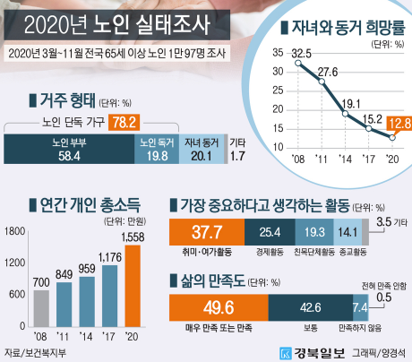

## 문제점제기
- 경로당 이용률  
부산_경로당_이용률.csv 로드에서 이용률이 15%이하로 나타내고 있어 기존 경로당의 만족도가 매우 낮은 것을 알수있다.
현재 급속도로 증가하고 있는 고령화 사회이지만 '경로당의 운영 주체인 대한노인회 관계자는 "경로당 회원 수 현황을 공개할 수 없다"면서도 "(회원 수가) 예전만큼 늘고 있지는 않다"고 말했다.'라는 것을 알수있다. 

- 액티브 시니어    
최근 우리나라에서 급속도로 증가하고 있는 노년층은, 과거 사회 다방면에서 다소 소극적이었던  기존의  고령계층과 달리 사회활동과 소비활동에 적극적인 모습을 보이며 도시 내 그들만의 새로운 도시 콘텐츠를 만들어 가면서 이전의 고령계층과는 차별화된 모습을 나타내고 있다.

## 이용률이 증가하지 않는 이유
- 경로당 이용 불만 사유   
경로당 이용에 대한 불만 사유를 살펴보면 18,664개소(29.1%)는 ‘다른 취미활동을 하고 있어서’라고 응답했으며, 17,857개소(27.9%)는 ‘경로당에 관심이 없어서’, 13,218개소(20.6%)는 ‘경로당에 프로그램이 없어서’, 3,431개소(5.4%)는 ‘특정인 이용중심으로 불편해서’라고 응답한것을 알수 있습니다. 

  |구  분|응답수|퍼센트|
  | :------| :---: | :---: |
  |다른 취미활동을 하고 있어서|18,664|29.1|
  |경로당에 관심이 없어서|17,857|27.9|
  |특정인 이용중심으로 불편하여|3,431|5.4|
  |경로당에 프로그램이 없어서|13,218|20.6|
  |기타|10,924|17.0|   

- 경로당 프로그램 불만족   
경로당 프로그램 불만족의 사유를 살펴보면 14,587개소(22.8%)는 ‘프로그램이 너무 단순하고 다양하지 못하다.’, 13,603개소(21.2%)는 ‘프로그램이 자주 제공되지 않는다.’, 10,566개소(16.5%)는 ‘흥미와 관심이 없는 프로그램이 제공되고 있어서’순으로 응답한 것을 알수 있습니다.

  |구  분|응답수|퍼센트|
  | :------| :---: | :---: |
  |프로그램이 너무 단순하고 다양하지 못하다|14,587|22.8|
  |흥미와 관심이 없는 프로그램이 제공되고 있다|10,566|16.5|
  |프로그램 제공자가 마음에 들지 않는다|1,110|1.7|
  |정기적인 프로그램이 지원되지 않는다|13,603|21.2|
  |프로그램을 하기 엔 장소가 협소하다|10,414|16.2|
  |기타|13,813|21.6|   

  * 참고자료(p61,p63): <https://www.knoldman.or.kr/bbs/board.php?bo_table=06_03&wr_id=38>

- 여가 및 사회활동 
  |구  분|퍼센트|
  | :------| :---: |
  |취미·여가활동|37.7|
  |경제활동|25.4|
  |친목활동|19.3|
  |종교활동|14.1|
  |기타|3.5|
 
- 정보화능력

노인의 스마트폰 보유 비율 증가
2011년 0.4% -> 2020년 56.4%

- 생활환경

노인의 83.8% 건강할 때 현재 집에서 거주하기를 원함

- 삶의 만족도
  |구  분|퍼센트|
  | :------| :---: |
  |매우 만족 또는 만족|49.6|
  |보통|42.6|
  |만족하지 않음|7.4|
  |전혀 만족 안함|0.5|
  
- 경제활동 참여율 및 개인 소득
  |구  분|개인 소득 증가|경제활동 참여율(%)|
  | :------| :---: | :---: |
  |2008년도|700만원|30.0
  |2017년도|1,176만원|30.9
  |2020년도|1,558만원|36.9
  
  * 참고자료 <http://www.mohw.go.kr/react/al/sal0301vw.jsp?PAR_MENU_ID=04&MENU_ID=0403&page=1&CONT_SEQ=365977>

 
- 고령계층의 인식변화   
   
기존의 고령계층은 사회 다방면에서 다소 소극적이며 도시와 다소 거리가 있는것을 선호하였으나, 현재의 고령계층은 도심생활에 익숙하고, 문화·쇼핑 등다양한 도시문화 콘텐츠를 즐기는 모습을 볼 수 있습니다.    
이처럼 시대가 바뀌는것에 따라 고령계층의 인식의 변화와 리즈가 변화하며, 단순히 쉬는 것이 아닌 활동적인 것을(다양한 여가와 취미생활) 선호하는 것을 알 수 있습니다.   
또한 정보화 시대의 발전과 생계비 마련, 고학력자 비율 증가에 따라 노인들의 경제활동의 참여율의 지속적인 증가로 경제의 자립성이 높아지는 특성을 보이고 있다.
현재 지역과 국가에 지원받아 요양보호사, 사회복지사 등 전문가로 구성되어 있는 노인복지센터에서 추가적인 낮은 비용만 지불하면 회원들은 다양한 활동들은 선택하고 즐길수 있는것을 알 수 있었습니다.
이에 따라 기존의 경로당의 쉬는 장소의 인식에 벗어나 리즈에 맞는 변화와 꾸준한 관리가 필요하다고 생각합니다.  
